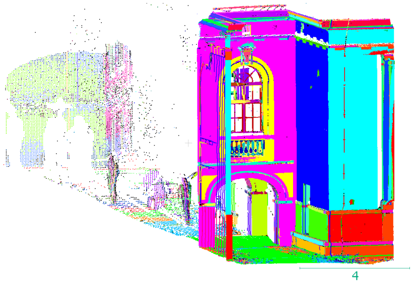

<html>
<body>
	<h2>Detection of planes in a point cloud via RANSAC</h2>
	
This section describes an application of Random Sample Consensus (RANSAC) algorithm for detection of planes in a point cloud.
	RANSAC is widely used for fitting a model to experimental data. RANSAC uses an approach which is opposite to classical algorithms of parameter estimation. Instead of iterating through derivation of a solution from as much data as possible and elimination of outliers, RANSAC uses the smallest possible dataset to define the model and then computes an amount of data which agree with it. In this case gross errors don't have any influence: the only amount of consistent data plays a role.

	
The goal of the current project was detection of planes via RANSAC in a point cloud of approximately 400 000 points which is result of laser scanning of buildings in Charite clinic in Berlin. Depending on values of hyper-parameters, the result can be more detailed as it is on the following picture:

	    
	
or be more generalised:

	    
	
Algorithm itself, it's application and results are presented in a scientific article which was written by me and can be downloaded as a pdf-file: 
 
	
<a href="https://github.com/kuramin/Ransac_Plane_Detection/blob/master/Ransac_Kuramin.pdf">Plane detection in a point cloud via RANSAC.pdf</a> 
		
</body>
</html>